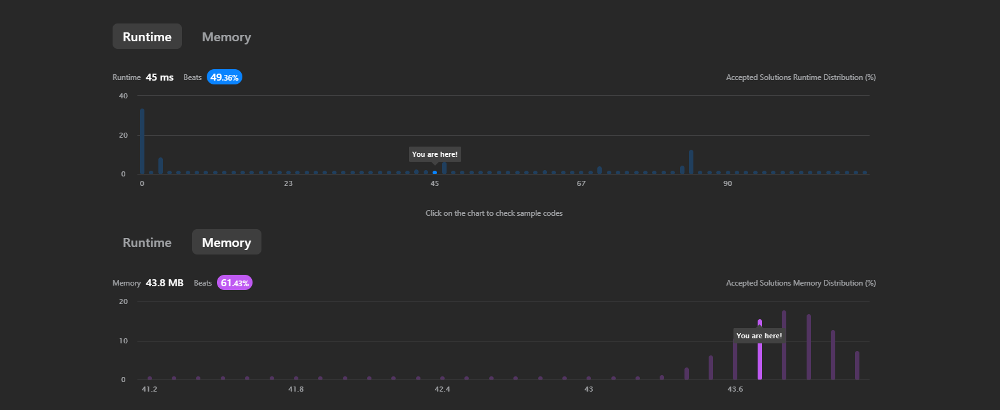

[LeetCode > Problem List](https://leetcode.com/problems/two-sum/)

# 1. Two Sum
###### Easy

Given an array of integers nums and an integer target, return indices of the two numbers such that they add up to target.

You may assume that each input would have exactly one solution, and you may not use the same element twice.

You can return the answer in any order.


## (+)
Example 1:
```
Input: nums = [2,7,11,15], target = 9
Output: [0,1]
Explanation: Because nums[0] + nums[1] == 9, we return [0, 1].
```

Example 2:
```
Input: nums = [3,2,4], target = 6
Output: [1,2]
```
Example 3:
```
Input: nums = [3,3], target = 6
Output: [0,1]
```

Constraints:
- `2 <= nums.length <= 10^4`
- `-10^9 <= nums[i] <= 10^9`
- `-10^9 <= target <= 10^9`
- Only one valid answer exists.

***


## My submission
```java
class Solution { 
        public int[] twoSum(int[] nums, int target) {
            // Constraints
            boolean validLength = nums.length >= 2 && nums.length <= 1e4;
            boolean validNums = true;
            for (int num : nums) {
                if (num < -1e9 || num > 1e9) {
                    validNums = false;
                    break;
                }
            }
            boolean validTarget = target >= -1e9 && target <= 1e9;

            // Check constraints 
            if (!(validLength || validNums || validTarget)){
                return null;
            }

            int[] result = new int[2];
            for(int i = 0; i < nums.length-1; i++){
                for(int j = i+1; j < nums.length; j++){
                    if(nums[i] + nums[j] == target){
                        result[0] = i;
                        result[1] = j;
                        return result;
                    }
                }
            }

            return null;
    }
 }
```

이미지 출처 - Leet Code_Submissions_Details

***
## Follow-up: Can you come up with an algorithm that is less than O(n2) time complexity?
### So I asked ChatGPT
```java
import java.util.HashMap;
import java.util.Map;

public class Solution {
    public int[] twoSum(int[] nums, int target) {
        Map<Integer, Integer> numToIndex = new HashMap<>();
        
        for (int i = 0; i < nums.length; i++) {
            int complement = target - nums[i];
            if (numToIndex.containsKey(complement)) {
                return new int[] { numToIndex.get(complement), i };
            }
            numToIndex.put(nums[i], i);
        }
        
        return null; // No valid solution found
    }
}
```


chatGPT는 답변해 주었다.

HashMap을 사용하여 배열을 순회하면 위의 내가 작성한 코드보다 시간 복잡도를 더 효율적으로 줄일 수 있다.

이 접근 방식은 런타임 효율성을 개선하기 위해 공간을 추가로 사용하여(공간 효율성 감소) Hash Map을 저장하는데, 이를 통해 시간 복잡도를 O(n)까지 줄일 수 있다.

또한 이 방식은 브루트 포스(Brute Force) 방식으로 큰 배열을 탐색하는 것에 비해서 효율적이다.

코드 순서
1. 배열의 각 요소와 해당 인덱스를 저장하는 HashMap을 생성한다.
2. 배열을 반복한다. 
   - 보수 값(목표에서 현재 요소를 뺀 값)을 계산한다. 
   - HashMap에 보수가 존재하는지 확인한다. 존재한다면 유효한 쌍을 찾은 것이다.
   - HashMap에 없는 경우 현재 요소를 HashMap에 추가한다. 
3. 목표 합계를 구성하는 두 요소의 인덱스를 반환한다.

