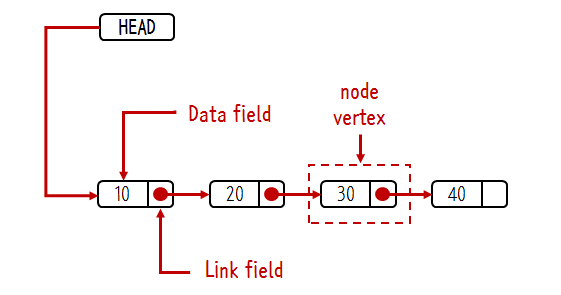

# 2.1. Linked List
###### 2_AddTwoNumbers 문제의 핵심 개념인 Linked List를 깊게 이해하기 위함

## 개념
[Opentutorials.org LInked list](https://opentutorials.org/module/1335/8821)


###### 이미지 출처 - [Opentutorials 모듈 - 자료구조_Linked List](https://opentutorials.org/module/1335)

### 1. Linked List란?
연결된<sub>(linked)</sub> 노드<sub>(node 혹은 vertex, 이하 node로 통일)</sub> 들의 모임

### 2. Linked List 기본 구성
    node(Data filed, Link filed), head, tail
- node: Data field(노드의 값), Link field(다음 노드)에 대한 정보를 가진 요소
- head: 첫 번째 노드를 가리키는 노드
- tail: 마지막 노드를 가리키는 노드

### 3. Linked List 기본 동작

#### - 노드 추가
  - 시작 위치에 노드 추가
    1. 새로운 노드 생성
    2. 새로운 노드의 다음 노드로 첫 번째 노드를 가리킴
    3. head 노드의 Link filed 값 변경
  - 중간 위치에 노드 추가
    - 가정 : 3번째 위치에 노드 추가
    1. 새로운 노드 생성
    2. head를 참조하여 추가할 위치의 앞 노드와 뒤 노드를 탐색
    3. 그 앞 노드가 새로운 노드를 가리킴
    4. 새로운 노드가 그 뒤 노드를 가리킴
#### - 노드 제거
   1. head를 참조하여 제거할 노드를 탐색
   2. 제거할 노드의 앞 노드를 탐색
   3. 제거할 노드의 앞 노드가 제거할 노드의 뒤 노드를 가리킴
   4. 제거할 노드를 제거
 - 노드 조회 
   - head를 참조하여 조회할 노드를 탐색
   - 만약 찾고자 하는 요소가 가장 끝에 있다면 모든 노드를 탐색해야 한다.
 

## Java 코드

```java
/**
 *  우선, public 로 LinkedList 클래스를 생성한 후 
 *  해당 클래스 내부에 Node 클래스를 private로 생성한다.
 *  LinkedList 클래스 내부에서만 접근할 수 있도록 접근을 제한한다.
 */

public class LinkedList {

    private class Node{
//      객체
        private Object value;
        private Node next;
        
//      생성자
        public Node(){}
        public Node(Object data) {
            this.data = data;
            this.next = null;
        }
        public Node(Object data, Node next){
            this.data = data;
            this.next = next;
        }
        
//      노드 값을 확인하기 위한 메서드
        public String toString(){
            return String.valueOf(this.data);
        }
    }
}

```
참고 - [Opentutorials.org LInked List - Java 구현](https://opentutorials.org/module/1335/8857)


