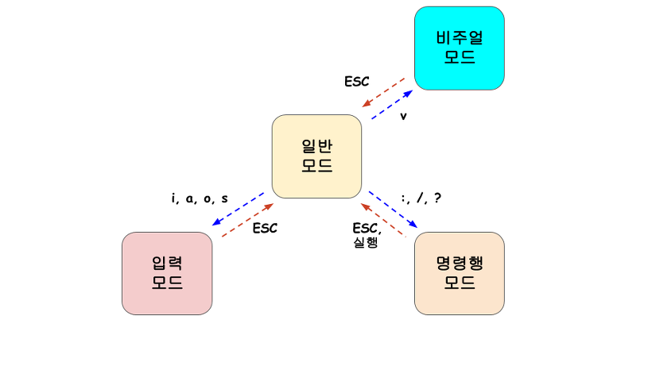

# 05. Vim 기초 사용법
###### 강의 출처 - [2023 OSSCA 기본 교육_5-VIM기초사용법](https://www.youtube.com/watch?v=gdBD3_tDW6g&list=PL8MaVgZDhGk-z7cezrPFJ5y6v3GW_S1iF&index=7)

***
### 들어가며
1. <a href="#vim">Vim 이란?</a>
   - Vim의 4가지 모드
2. <a href="#open">Vim 으로 파일 열기</a>
3. <a href="#write">Vim 으로 파일 작성</a>
4. <a href="#more">조금 더</a>

***
## Vim 이란?
- Linux의 대표적인 텍스트 편집기 vi와 호환되는 텍스트 편집기

### Vim의 4가지 모드

###### 이미지 출처 - [[Vim] 모드 이해](https://gracefulprograming.tistory.com/30)
  1. 일반 모드 (Normal Mode)
     - 처음 실행시 모드
     - 커서 이동, 삭제, 복사, 붙여넣기 등의 작업을 위해 vim에 명령을 내리는 모드
  2. 입력 모드 (Insert Mode)
     - 실제로 문서를 편집하기 위한 모드
     - `i`, `a`, `I`, `A` 키를 통해 입력 모드로 전환
  3. 명령 라인 모드 (Command-line Mode)
     - 파일의 열기, 저장, Vim의 설정, 특정 패턴 검색, Vim의 종료 등의 명령을 내리는 모드
  4. 비주얼 모드 (Visual Mode)
     - vim에서 대부분의 명령을 수행할 때에는 범위를 지정할 수 있음
     - 문서 전체를 지정하거나 특정 행 또는 특정 행으로부터 N개의 행 등 다양한 방법으로 범위를 지정할 수 있음
     - 마치 마우스로 드래그 해서 범위를 지정하듯이 커서 이동을 통해 블록 단위로 범위를 지정할 수 있음

***
## Vim 으로 파일 열기
`$ vi [파일명.확장자]`
- 예시) `$ vi test.txt`

***
## Vim 으로 파일 작성
1. 입력 모드
   - 일반 모드로 전환 `esc`
   - 입력 모드로 전환 `i`, `a`, `I`, `A`
     - `i`: insert (커서 앞) 
     - `a`: append (커서 뒤)
     - `I`: 문장 시작
     - `A`: 문장 끝

2. 명령 라인 모드 
   - 일반 모드로 전환 `esc`
   - 명령모드로 전환 : `:`, `/`, `?`
   - 종료옵션
     - `:q`: 그냥 종료
     - `:q!`: 강제 종료
     - `:w`: 저장
     - `:w!`: 강제 저장
     - `:wq`: 저장하고 종료
     - `:wq!`: 강제 저장하고 종료

3. 일반 모드
    - 네이게이션 모드
      - 상하좌우
        * 방향키로도 사용 가능
        - `h`: 왼쪽
        - `j`: 아래
        - `k`: 위
        - `l`: 오른쪽
      - 기준으로 이동
        - `0`: 문장 앞으로 이동
        - `$`: 문장 뒤로 이동
        - `w`: (word) 한 단어씩 오른쪽으로 이동
          - 예시) `3w`: 3단어씩 이동
        - `b`: (backward) 한 단어씩 왼쪽으로 이동
      - 큰 범위로 이동 
        - `H`: 화면 위
        - `M`: 화면 중간
        - `L`: 화면 끝
        - `gg`: 파일 앞
        - `G`: 파일 끝
          - 예시) `20G`: 20번째 줄로 이동
      - 스크롤링
        - `ctrl u`: 위로 스크롤링
        - `ctrl d`: 아래로 스크롤링
        - `{`: 문단 시작
        - `}`: 문단 끝	
    - 명령어
      - `x`: 커서 아래 글자 삭제
      - `dd`: 문장 삭제
      - `yy`: 문장 복사
      - `p`: 붙여넣기
      - `*p`: 클립보드 붙여넣기
      - 클립보드 붙여넣기가 가능하도록 하려면 권한 설정이 필요함
      - `vim.useSystemClipboard`: true

***
## 조금 더
###### 출처 - [[YouTube 드림코딩] Vim 제대로 가르쳐 줌 🤓 (개발자라면 한번쯤 꼭 쓴다는 Vim)](https://www.youtube.com/watch?v=cY0JxzENBJg)
-   | COMMAND |              | * | OBJECT |                   |
    |---------|--------------|---|--------|-------------------|
    | d       | delete (cut) |   | 3w     |                   |
    | y       | yank (copy)  |   | 3b     |                   |
    | c       | change       |   | aw     | (a word)          |
    |         |              |   | at     | (a tag)           |
    |         |              |   | as     | (a paragraph)     |
    |         |              |   | as     | (a sentence)      |
    |         |              |   | it     | (inner tag)       |
    |         |              |   | i"     | (inner "")        |
    |         |              |   | ip     | (inner paragraph) |
- 예시
    - `d3w`: delete 3 words
    - `dit`: delete inner tags
       - 태그 내 모든 텍스트를 삭제하라.
    - `df(`: 커서부분부터 소괄호까지 삭제(소괄호 포함)
       - f : find
    - `dt(`: 커서부분부터 소괄호 앞까지 삭제(소괄호 비포함)
    - `d/(sh`: 커서부분부터 "(sh"를 찾아서 그 앞까지 삭제
    - `vaw`: 단어 하나 셀렉
- 명령어
- | COMMAND        |              |
  |----------------|--------------|
  | .              | 이전 명령 반복     |
  | u              | undo	되감기     |
  | ctrl R         | redo	앞감기     |
  | /              | 찾기           |
  | n              | 다음 단어 찾기     |
  | ?(단어) nnn... | 거꾸로 다음 단어 찾기 |
  | v 방향키       | select       |
  | ctrl v         | 블럭 단위 셀렉     |

***
###### 참고 사이트 출처 리스트
###### 1. (영상) [2023 OSSCA 기본 교육_5-VIM기초사용법](https://www.youtube.com/watch?v=gdBD3_tDW6g&list=PL8MaVgZDhGk-z7cezrPFJ5y6v3GW_S1iF&index=7)
###### 2. (볼로그) [Vim 이란 무엇인가?](https://juyoungit.tistory.com/428)
###### 3. (볼로그) [[Vim] 모드 이해](https://gracefulprograming.tistory.com/30)
###### 4. (영상) [Vim 제대로 가르쳐 줌 🤓 (개발자라면 한번쯤 꼭 쓴다는 Vim)](https://www.youtube.com/watch?v=cY0JxzENBJg)
###### 5. (문서) [Vim User Manual](https://vimdoc.sourceforge.net/)
