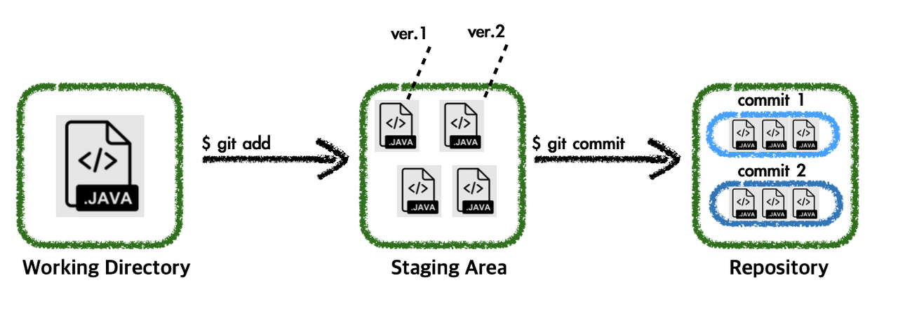

# 10. Staging 영역과 gitignore 파일
###### 강의 출처 - [2023 OSSCA 기본 교육_18-스테이징영역과gitignore파일](https://www.youtube.com/watch?v=jeai5fryrfY&list=PL8MaVgZDhGk-z7cezrPFJ5y6v3GW_S1iF&index=20)

***
### 들어가며
1. <a href="#area">Staging Area</a>
   - <a href="#add">Add</a>
   - <a href="#reset">Reset HEAD</a>
2. <a href="#lifecycle">File Status Lifecycle in Git</a>
3. <a href="#gitignore">`.gitignore` File</a>
- <a href="#instruction">명령어</a>

***
## Staging Area
스테이징 영역은 commit 시에 불필요한 파일이 포함되지 않도록 주의가 필요

###### 출처 - [[Git] Git 3가지 영역 (Staging Area) - Commit 이해하기](https://iseunghan.tistory.com/322)
- Working Directory : 내가 작업하고 있는 프로젝트의 디렉터리
- Staging Area : 커밋을 하기 위해 $ git add 명령어로 추가한 파일들이 모여있는 공간
- Repository : 커밋들이 모여있는 저장소
- 왜 바로 커밋하지 않고 Staging Area를 거쳐야 하는가? 
    - [Git의 Staging Area는 어떤 점이 유용한가](https://blog.npcode.com/2012/10/23/git%EC%9D%98-staging-area%EB%8A%94-%EC%96%B4%EB%96%A4-%EC%A0%90%EC%9D%B4-%EC%9C%A0%EC%9A%A9%ED%95%9C%EA%B0%80/) (클릭)

### <sapn id="add">Add
- Working Directory에 있는 파일 중 원하는 파일을 Staging Area에 추가하는 명령어
  - `$ git add [파일명.확장자]`: 특정 파일을 Staging Area에 추가하는 명령어
  - `$ git add .`: 수정된 모든 파일을 Staging Area에 추가하는 명령어

### Reset HEAD
- Staging Area에 있는 파일을 Working Directory로 옮기는 명령어
  - `$ git reset HEAD [파일명.확장자]`: 특정 파일을 Staging Area에서 제거하는 명령어
  - `$ git reset HEAD .`: Staging Area에 등록된 모든 파일을 제거하는 명령어
***
## File Status Lifecycle in Git
File 관점에서 보는 4가지 단계

- Untracked : Working Directory에 있는 파일이지만 Git으로 버전관리를 하지 않는 상태
- Unmodified : 신규로 파일이 추가되었을 때, new file 상태와 같다. ( $ git add 상태 )
- Modified : 파일이 추가된 이후 해당 파일이 수정되었을 때의 상태
- Staged : Staging Area에 반영된 상태
###### 출처 - [[Git] Git 3가지 영역 (Staging Area) - Commit 이해하기](https://iseunghan.tistory.com/322)

***
## `.gitignore` File
- 원하지 않는 파일은 git에서 관리하지 않도록 해주는 장치
- `.gitignore` 파일을 통해 불필요한 파일의 업로드를 억제할 수 있음
  ###### 불필요한 파일 - IDE, 프레임워크, 언어, 운영체제 등에 따라 생성되거나 수정된 파일
- git ignore generator로 구글에서 검색 또는 IDE에서 익스텐션 추가하는 방법으로 사용 가능
###### 참고 - [gitignore.io](https://www.toptal.com/developers/gitignore)

***
### <sapn id="instruction">명령어
- Add to staging area
  - `$ git add [파일명.확장자]`
  - `$ git add .`
- Remove from staging area
  - `$ git reset HEAD [파일명.확장자]`
  - `$ git reset HEAD .`

***
###### 참고 사이트 및 출처 리스트
###### 1. (영상) [2023 OSSCA 기본 교육_18-스테이징영역과gitignore파일](https://www.youtube.com/watch?v=jeai5fryrfY&list=PL8MaVgZDhGk-z7cezrPFJ5y6v3GW_S1iF&index=20)
###### 2. (참고) [gitignore.io](https://www.toptal.com/developers/gitignore)
###### 3. (블로그) [[Git] Git 3가지 영역 (Staging Area) - Commit 이해하기](https://iseunghan.tistory.com/322)
###### 3. (블로그) [Git의 Staging Area는 어떤 점이 유용한가](https://blog.npcode.com/2012/10/23/git%EC%9D%98-staging-area%EB%8A%94-%EC%96%B4%EB%96%A4-%EC%A0%90%EC%9D%B4-%EC%9C%A0%EC%9A%A9%ED%95%9C%EA%B0%80/)
