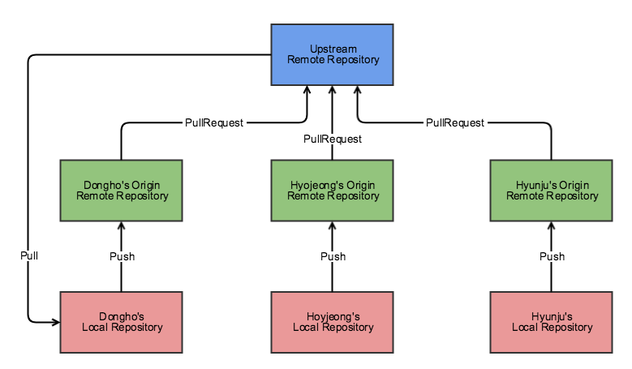

# 12. Rebase

***
### 들어가며
1. <a href="#rebase">Rebase</a>
2. <a href="#interactive">Interactive Rebase</a>
    - <a href="#pick">`pick`</a>
     - <a href="#reword">`reword`</a>
     - <a href="#edit">`edit`</a>
     - <a href="#squash">`squash`, `fixup`</a>
     - <a href="#exec">`exec`</a>
     - <a href="#break">`break`</a>
     - <a href="#drop">`drop`</a>
     - <a href="#merge">`merge`</a>

***
### Rebase
- 아래의 그림과 같은 브랜치 전략을 취한다고 가정함

  ###### 이미지 출처 - [[우아한 형제들] 우린 Git-flow를 사용하고 있어요](https://techblog.woowahan.com/2553/)
- 동기화
  1. upstream 저장소에 반영된 변경분들을 가져옴
     `$ git fetch upstream`
  2. 로컬 저장소의 main 브랜치와 upstream 저장소의 main 브랜치를 동기화하는 것이기 때문에 일단 영향을 미칠 브랜치인 main으로 전환
     `$ git checkout main`
  3. 로컬 저장소의 main 브랜치에 upstream 저장소의 main 브랜치에 있는 커밋들을 추가하려는 것이기 때문에 merge 명령어 사용
     `$ git merge upstream/main`
- 참고
  - origin은 clone한 저장소를 관습적으로 부르는 말임
  - upstream 또한 관습적으로 부르는 말임
  - [실습] - [(GitHub) rebase-practice](https://github.com/EunseongHeo/rebase-practice)

***
## Interactive Rebase 
###### 참고 - [Git Rebase --Interactive 옵션 알아보기](https://wormwlrm.github.io/2020/09/03/Git-rebase-with-interactive-option.html)
- interactive: 대화형의 
- `git rebase -i ${수정할 커밋의 직전 커밋}`
- `git rebase -i HEAD~3`

### pick
> `p`, `pick`: use commit
- 커밋 순서 재정렬, 커밋 삭제 용도로 사용 가능
- 단, 수정한 커밋 히스토리가 서로 의존성을 갖고 있는 경우에는 충돌이 발생하므로 별도의 처리 필요

### reword
> `r`, `reword`: use commit, but edit the commit message
- 커밋 메시지를 수정 용도로 사용 가능

### edit
> `e`, `edit`: use commit, but stop for amending
- 커밋의 명령어, 작업 내용도 수정 용도로 사용 가능
  - `git commit --amend`: 커밋 메시지를 수정  
  - `git rebase --continue`: 수정을 완료 시
- 커밋 메시지를 수정할 수 있음
- 새 파일 생성 후 `git add`, `git commit -m message` 명령어를 이용하여 새 커밋 추가 가능

### squash, fixup
> `s`, `squash`: use commit, but meld into previous commit
> `f`, `fixup`: like “squash”, but discard this commit’s log message
- 해당 커밋을 이전 커밋과 합치는 명령어
- 차이
  - `squash`: 각 커밋들의 메시지가 합쳐짐
    - commit description 으로 확인 가능
  - `fixup `: 이전의 커밋 메시지만 남김

### exec
> `x`, `exec`: run command (the rest of the line) using shell
- 리베이스 도중에 실행할 쉘 커맨드를 입력할 수 있게 해주는 명령어
- `exec git log -1 --pretty=format:%B`
  - `git log -1 --pretty=format:%B`: 직전 커밋의 메시지만을 출력하는 커맨드

### break
> `b`, `break`: stop here (continue rebase later with ‘git rebase —continue’)
- 해당 라인에서 리베이스를 일시중지하는 명령어
- `git rebase --continue`: 재개

### drop
> `d`, `drop`: remove commit 
- 해당 커밋을 명시적으로 삭제하는 명령어
- pick 명령어를 통해 커밋을 삭제하는 것과 동일한 결과물을 반환함

### merge
> `m`, `merge`: create a merge commit using the original merge commit’s message
- `m, merge [-C <commit> or -c <commit>] <label> [# <oneline>]`
- 머지 커밋을 만들면서 머지하는 명령어
- 커밋 로그에서 확인할 수 있음
- 다른 브랜치에서 작업한 커밋을 가져와 리베이스 마지막 단계에 merge 시키는 방법으로도 사용할 수 있음

***
### 꼭 기억해 둘 옵션
- `pick`
- `edit`
- `squash`

***
###### 참고 사이트 및 출처 리스트
###### 1. (GitHub) [[재그지그] Git Rebase --Interactive 옵션 알아보기](https://wormwlrm.github.io/2020/09/03/Git-rebase-with-interactive-option.html) 
###### 2. 20230722 ~ 20230831 2023OPENUP 온라인 강의
