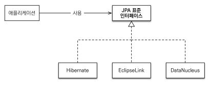

# 01. JPA 개요
###### 인프런 - [자바 ORM 표준 JPA 프로그래밍 - 기본편](https://www.inflearn.com/course/ORM-JPA-Basic)

***
### 들어가며
- SQL 중심적인 개발의 문제점
- ORM
- JPA란?

***
## SQL 중심적인 개발의 문제점
###### 참고 - [SQL 중심적인 개발의 문제점](https://hudi.blog/problems-sql-centered-development/)
- 반복적인 객체-테이블 매핑과 CRUD
- 객체 그래프 탐색의 어려움
- 객체 로딩에 대한 문제
- 진정한 의미의 계층 분할의 어려움
    ### 객체 vs RDB
    - 상속에 대한 개념
    - 연관 관계에 대한 개념
    - 데이터 타입
    - 데이터 식별 방법
    - 조회

## ORM
- Object-relational mapping(객체 관계 매핑)
- ORM 프레임워크가 객체 설계와 RDB 설계 사이에서 매핑함
- SQL 중심적인 개발에서 객체 중심적인 개발로 전환하기 위해 발전한 기술

## JPA란?

###### 이미지 출처 - 인프런 강의 자료
- Java Persistence API
- JPA는 애플리케이션과 JDBC 사이에서 동작
- 오픈소스(Hibernate)에서 출발한 자바 표준임
    ###### Hibernate 창시자 - Gavin King
    ### JPA를 사용해야 하는 이유?
    - SQL 중심적인 개발에서 객체 중심으로 개발
    - 생산성 - CRUD
    - 유지보수
    - 패러다임의 불일치 해결
    - 성능 최적화 기능
    - 표준

*** 출처 및 참고
- ###### (인프런) [자바 ORM 표준 JPA 프로그래밍 - 기본편](https://www.inflearn.com/course/ORM-JPA-Basic)
- ###### (블로그) [SQL 중심적인 개발의 문제점](https://hudi.blog/problems-sql-centered-development/)
