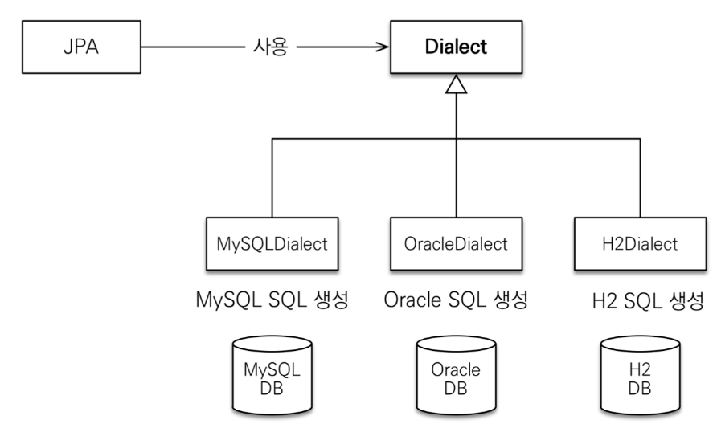
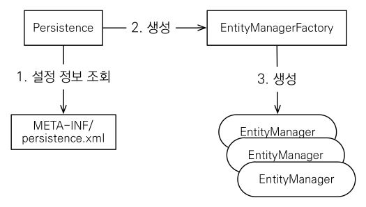

# 02. Hello JPA 실습
###### 인프런 - [자바 ORM 표준 JPA 프로그래밍 - 기본편](https://www.inflearn.com/course/ORM-JPA-Basic)
###### 실습 GitHub Repository - [hello-jpa](https://github.com/EunseongHeo/hello-jpa)

***
### 들어가며
1. H2 데이터베이스
2. 메이븐
3. 프로젝트 생성
   - 3.1. 라이브러리 추가
   - 3.2. JPA 설정
   - 3.3. 객체와 테이블 생성 및 매핑
   - 3.4. 실습

***
## 1. H2 데이터베이스
- 가볍다
- MySQL, ORACLE 시뮬레이션 가능
- 브라우저 화면을 띄움(별도의 프로그램 설치 x)

***
## 2. 메이븐
- 빌드 관리
- 의존성 관리
- 최근엔 Gradle을 많이 사용함
>    1. Maven은 xml 로 표현되고 Gradle은 groovy로 표현된다.
>    2. 프로젝트가 규모가 커질수록 Gradle이 유용하다.
>    3. Gradle은 멀티프로젝트에 매우 적합하며 빌드 속도 또한 Maven에 비하여 10~100 배 더 빠르다.
###### 참고 - [gradle과 maven의 차이](https://www.inflearn.com/questions/189361/gradle%EA%B3%BC-maven%EC%9D%98-%EC%B0%A8%EC%9D%B4)

***
## 3. 프로젝트 생성
###### [Repo] [hello-jpa](https://github.com/EunseongHeo/hello-jpa) 
- 자바 8 이상(8 권장)
- 메이븐 설정
  - groupId: jpa-basic
  - arifactId: hello-jpa
  - version: 1.0.0 => 1.0-SNAPSHOT

***
### 3.1. 라이브러리 추가
###### 참고 - [MVN REPOSITORY](https://mvnrepository.com/) 
[pom.xml]
- Hibernate
  - 강의 내용과 일치하는 버전(5.3.10.Final)으로 맞춤
```xml
<!-- JPA 하이버네이트 -->
<dependency>
    <groupId>org.hibernate</groupId>
    <artifactId>hibernate-entitymanager</artifactId>
    <version>5.3.10.Final</version>
</dependency>
```
- h2
  - 실습 당시 최신 버전(2.2.224)으로 인스톨했기 때문에 이 버전과 같게 맞춤
```xml
<!-- H2 데이터베이스 -->
<dependency>
    <groupId>com.h2database</groupId>
    <artifactId>h2</artifactId>
    <version>2.2.224</version>
</dependency>
```
- ###### 추가 시, JDK 11 버전으로 진행했었으나 에러 발생으로 JDK8을 다운로드 받아 환경변수 재설정을 마침 참고한 블로그 링크는 [여기](https://the-duchi.tistory.com/4)
- ###### JDK 11인 경우, 아래 코드 추가
  ```xml
  <dependency>
      <groupId>javax.xml.bind</groupId>
      <artifactId>jaxb-api</artifactId>
      <version>2.3.0</version> 
  </dependency>
  ```

- pom.xml(천체 내용)
```xml
<?xml version="1.0" encoding="UTF-8"?>
<project xmlns="http://maven.apache.org/POM/4.0.0"
         xmlns:xsi="http://www.w3.org/2001/XMLSchema-instance"
         xsi:schemaLocation="http://maven.apache.org/POM/4.0.0 http://maven.apache.org/xsd/maven-4.0.0.xsd">
    <modelVersion>4.0.0</modelVersion>

    <groupId>jpa-basic</groupId>
    <artifactId>hello-jpa</artifactId>
    <version>1.0-SNAPSHOT</version>

    <properties>
        <maven.compiler.source>8</maven.compiler.source>
        <maven.compiler.target>8</maven.compiler.target>
        <project.build.sourceEncoding>UTF-8</project.build.sourceEncoding>
    </properties>

    <dependencies>
        <!-- JPA 하이버네이트 -->
        <dependency>
            <groupId>org.hibernate</groupId>
            <artifactId>hibernate-entitymanager</artifactId>
            <version>5.3.10.Final</version>
        </dependency>
        <!-- H2 데이터베이스 -->
        <dependency>
            <groupId>com.h2database</groupId>
            <artifactId>h2</artifactId>
            <version>2.2.224</version>
        </dependency>
    </dependencies>
</project>
```

***
### 3.2. JPA 설정
- persistence.xml 파일 추가
- 경로: .\resources\META-INF\persistence.xml
- 필수 속성
  - javax.persistence로 시작: JPA 표준 속성
  - Hibernate로 시작: 하이버네이트 전용 속성
    - 
    - H2 :	`<property name="hibernate.dialect" value="org.hibernate.dialect.H2Dialect"/>`
    - ORACLE:	`<property name="hibernate.dialect" value="org.hibernate.dialect.Oracle10gDialect"/>`
    - MySQL:	`<property name="hibernate.dialect" value="org.hibernate.dialect.MySQL5InnoDBDialect"/>`

    ```xml
    <property name="javax.persistence.jdbc.driver" value="org.h2.Driver"/>
    <property name="javax.persistence.jdbc.user" value="sa"/>
    <property name="javax.persistence.jdbc.password" value=""/>
    <property name="javax.persistence.jdbc.url" value="jdbc:h2:tcp://localhost/~/test"/>
    <property name="hibernate.dialect" value="org.hibernate.dialect.H2Dialect"/>
    ```
- 옵션
  ````xml
  <property name="hibernate.show_sql" value="true"/>
  <property name="hibernate.format_sql" value="true"/>
  <property name="hibernate.use_sql_comments" value="true"/>
  ````
- persistence.xml(전체 내용)
```xml
<?xml version="1.0" encoding="utf-8"?>
<persistence version="2.2"
             xmlns="http://xmlns.jcp.org/xml/ns/persistence"
             xmlns:xsi="http://www.w3.org/2001/XMLSchema-instance"
             xsi:schemaLocation="http://xmlns.jcp.org/xml/ns/persistence http://xmlns.jcp.org/xml/ns/persistence/persistence_2_2.xsd">
    <persistence-unit name="hello">
        <properties>
            <!-- 필수 속성 -->
            <property name="javax.persistence.jdbc.driver" value="org.h2.Driver"/>
            <property name="javax.persistence.jdbc.user" value="sa"/>
            <property name="javax.persistence.jdbc.password" value=""/>
            <property name="javax.persistence.jdbc.url" value="jdbc:h2:tcp://localhost/~/test"/>
            <property name="hibernate.dialect" value="org.hibernate.dialect.H2Dialect"/>
            <!-- 옵션 -->
            <property name="hibernate.show_sql" value="true"/>
            <property name="hibernate.format_sql" value="true"/>
            <property name="hibernate.use_sql_comments" value="true"/>
            <!--<property name="hibernate.hbm2ddl.auto" value="create" />-->
        </properties>
    </persistence-unit>
</persistence>
```

***
### 3.3. 객체와 테이블 생성 및 매핑
#### 3.3.1. JPA 구동 방식
  
  1. Persistence 클래스
     - META-INF/persistence.xml 설정 파일 읽기
  2. EntityManagerFactory 클래스 생성
  3. 트랜잭션마다 EntityMagnager 클래스 생성하여 사용 후 닫기

#### 3.3.2. JPA 사용 시 주의
- EntityManagerFactory(은)는는 하나만 생성하여 애플리케이션 전체에서 공유함
- EntityManager(은)는 쓰레드간에 공유 X (사용하고 꼭! 닫기)
  - 일회성으로 사용하는 것을 권장
  - new 연산자로 객체 생성, `객체.close()`로 버리기
- JPA의 모든 데이터 변경은 트랜잭션(`try ~ catch`) 내에서 실행
  * JPA가 아무리 날고 긴다 해도 RDB 자체가 데이터 변경을 트랜잭션 내에서 실행되도록 설계되어 있기 때문에 한계가 존재함
  * 사용자가 트랜잭션을 지정하지 않아도 DB 내부적으로는 트랜잭션 개념으로 작동하고 있다고 생각하기

***
### 3.4. 실습
###### 참고 - [(GitHub Repository) hello-jpa](https://github.com/EunseongHeo/hello-jpa)
#### 3.4.1. JPQL
- JPA를 사용하면 엔티티 객체를 중심으로 개발
- 문제는 검색 쿼리
- 검색할 때도 테이블이 아닌 엔티티 객체를 대상으로 검색
- 모든 DB 데이터를 객체로 변환해서 검색하는 것은 불가능
- 애플리케이션이 필요한 데이터만 DB에서 불러오려면 결국 검색 조건이 포함된 SQL이 필요
  - 단, RDB의 물리적인 테이블을 대상으로 쿼리를 작성하면 그 DB에 종속된 설계가 됨
  - 그래서, Entity 객체를 대상으로 쿼리를 할 수 있는 JPQL이 제공되는 것임
- JPA는 SQL을 추상화한 JPQL이라는 객체 지향 쿼리 언어 제공
- SQL과 문법 유사, SELECT, FROM, WHERE, GROUP BY, HAVING, JOIN 지원
- JPQL은 엔티티 객체를 대상으로 쿼리
- SQL은 데이터베이스 테이블을 대상으로 쿼리

- 테이블이 아닌 객체를 대상으로 검색하는 객체 지향 쿼리
- SQL을 추상화해서 특정 데이터베이스 SQL에 의존 X
  - 즉, 설정 파일의 정보만 수정하면 JPA가 알아서 DB에 맞게 쿼리 내용을 변경해 줌
- JPQL을 한마디로 정의하면 객체 지향 SQL
- JPQL은 뒤에서 아주 자세히 다룸

***
### 3.4.2. H2 DB의 MEMBER 테이블 생성
```h2
create table Member ( 

    id bigint not null, 
    name varchar(255), 
    primary key (id) 
);
```

***
### 3.4.3. Member 클래스 생성
- `@Entity`: JPA가 관리할 객체
- `@Table(name = "USER")`: 실제 DB의 테이블 이름이 클래스 이름과 다를 경우, 실제 DB의 테이블을 지정하는 어노테이션
- `@Id`: 데이터베이스 PK와 매핑
- `@Column(name = "username")`:실제 DB의 컬럼명이 객체명과 다를 경우, 실제 DB의 컬럼을 지정하는 어노테이션
```java
- 테이블 내용을 참고하며 작성
package hellojpa;

import javax.persistence.Entity;
import javax.persistence.Id;

@Entity
public class Member {
    @Id
    private Long id;
    private String name;

    public Long getId() {
        return id;
    }

    public void setId(Long id) {
        this.id = id;
    }

    public String getName() {
        return name;
    }

    public void setName(String name) {
        this.name = name;
    }
}
```

***
### 3.4.4. JpaMain 클래스 생성
- (주의) EntityManager의 객체는 한 트랜잭션 단위로 생성하고 닫아주어야 함
- (주의) EntityTransaction의 객체를 활용하여 트랜잭션의 시작을 알리고, 필요시 롤백할 수 있도록 코드를 구성하는 것의 관레임 
```java
package hellojpa;

import javax.persistence.EntityManager;
import javax.persistence.EntityManagerFactory;
import javax.persistence.EntityTransaction;
import javax.persistence.Persistence;
import java.util.List;

public class JpaMain {
    public static void main(String[] args) {

        EntityManagerFactory emf = Persistence.createEntityManagerFactory("hello");
        EntityManager em = emf.createEntityManager();
        EntityTransaction tx = em.getTransaction();
        tx.begin();
        try {

            // code
            
        } catch (Exception e){
            tx.rollback();
        } finally {
            em.close();
        }
        
        emf.close();
    }
}
```

***
### 3.4.5. 회원 등록
###### `// code` 부분에 들어가는 코드
```java
Member member = new Member();
member.setId(1L);
member.setName("HelloA");
em1.persist(member);
tx.commit();
```
- H2 DB에서 결과 확인
```h2
select * from MEMBER;
```

### 3.4.6. 회원 단건 조회
###### `// code` 부분에 들어가는 코드
```java
Member findMember = em.find(Member.class, 1L);
```
- 결과 확인 코드 및 결괏값
```java
System.out.println("member.name that id is 1L: " + findMember.getName());

==[결괏값]==============================================================
member.name that id is 1L: HelloJPA
```

### 3.4.7. 회원 수정
###### `// code` 부분에 들어가는 코드
```java
Member findMember = em.find(Member.class, 1L);
findMember.setName("HelloJPA");
tx.commit();
```
- H2 DB에서 결과 확인
```h2
select * from MEMBER where ID = 1;
```

### 3.4.8. 회원 삭제
###### `// code` 부분에 들어가는 코드
```java
Member findMember = em3.find(Member.class, 1L);
findMember.remove(findMember);
tx.commit();
```
- H2 DB에서 결과 확인
```h2
select * from MEMBER;
```

### 3.4.9. 특정 조건의 회원 다건 조회
  - JPQL
  - EntityManager의 객체를 통해 createQuery() 메서드 내에 필요한 내용을 작성
#### 예제 1_ 전체 회원 중 id가 5 ~ 8까지의 회원 검색
###### `// code` 부분에 들어가는 코드
```java
List<Member> result = em.createQuery("select m from Member as m", Member.class)
    .setFirstResult(5)
    .setMaxResults(8)
    .getResultList();
tx.commit();
```

#### 예제 2_ ID가 2 이상인 회원만 검색
###### `// code` 부분에 들어가는 코드
```java
List<Member> result = em.createQuery("select m from Member as m where m.id >=2", Member.class)
    .getResultList();
tx.commit();
```
 
#### 예제 3_ "JPQL" 이름의 회원만 검색
###### `// code` 부분에 들어가는 코드
```java
List<Member> result = em.createQuery("select m from Member as m where m.name = 'JPQL'", Member.class)
    .getResultList();
tx.commit();
```
 
*** 출처 및 참고
- ###### (인프런) [자바 ORM 표준 JPA 프로그래밍 - 기본편](https://www.inflearn.com/course/ORM-JPA-Basic)
- ###### (H2 Database) [H2 DB](http://www.h2database.com/)
- ###### (Maven) [Apache Maven Project](https://maven.apache.org/)
- ###### (인프런) [gradle과 maven의 차이](https://www.inflearn.com/questions/189361/gradle%EA%B3%BC-maven%EC%9D%98-%EC%B0%A8%EC%9D%B4)
- ###### (MVN REPOSITORY) [MVN REPOSITORY](https://mvnrepository.com/)
- ###### (블로그) Knowledge - [Repository H2 Database 설치, 서버 실행, 접속 방법 (Windows, MacOS)](https://atoz-develop.tistory.com/entry/H2-Database-%EC%84%A4%EC%B9%98-%EC%84%9C%EB%B2%84-%EC%8B%A4%ED%96%89-%EC%A0%91%EC%86%8D-%EB%B0%A9%EB%B2%95)
- ###### (블로그) I've always been - [JDK 8 다운로드 및 설치하기, 환경변수 설정 [Java개발환경 구축하기 1](https://the-duchi.tistory.com/4)
- ###### (실습 GitHub Repository) [hello-jpa](https://github.com/EunseongHeo/hello-jpa) 
