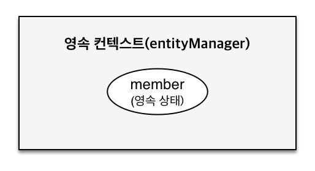

# 03. Persistence Context
###### 인프런 - [자바 ORM 표준 JPA 프로그래밍 - 기본편](https://www.inflearn.com/course/ORM-JPA-Basic)
###### 실습 GitHub Repository - [hello-jpa](https://github.com/EunseongHeo/hello-jpa)
###### 커밋 d57395b - [Learn the inner workings of JPA - Persistence Context(#4)](https://github.com/EunseongHeo/hello-jpa/commit/d57395b35e033b8c5e35094268aa08d02808f1ec?diff=unified)

***
### 들어가며
1. Persistence Context
   - JPA에서 가장 중요한 2가지
   - 엔티티의 생명주기
   - 영속성 컨텍스트의 이점
2. Flush
   - 플러시
   - 플러시 발생
   - 영속성 컨텍스트를 플러시하는 방법
   - 플러시 모드 옵션
3. Detached
   - 준 영속 상태
   - 준 영속 상태로 만드는 방법

***
## 1. Persistence Context
### 1.1. JPA에서 가장 중요한 2가지
- 객체와 RDB 매핑
  - HOW?
  - 설계와 관련
  - 정적
- 영속성 컨텍스트
  - Persistence Context
  - JPA 내부 동작 방식과 관련
> Persistence Context
> - 엔티티를 영구 저장하는 환경을 의미
> - 눈에 보이지 않는 논리적인 개념
> - EntityManager를 통하여 영속성 컨텍스트에 접근함
> - `EntityManager.persist(entity);`
>   - [의미]
>   - 영속성 컨텍스트를 통하여 Entity 를 영속한다.
>   - Entity를 영속성 컨텍스트에 저장한다. (DB x)
>   - 엔티티 매니저를 통해서 영속성 컨텍스트에 접근한다.
> - (EntityManager 생성 시, PersistenceContext라는 공간이 생성된다 (1:1) 라고 생각하기)
>> - J2SE 환경 ☞ 엔티티 매니저 : 영속성 컨텍스트 = 1 : 1
>> - J2EE, 스프링 프레임워크 같은 컨테이너 환경 ☞ 엔티티 매니저 : 영속성 컨텍스트 = N : 1

### 1.2. 엔티티의 생명주기
* EntityManager

#### 1.2.1. New (비 영속/transient)
- 영속된 컨텍스트와 전혀 관계가 없는 새로운 상태
- 즉, 객체만 생성한 상태

  ```java
  //객체를 생성한 상태(비 영속) 
  Member member = new Member();  
  member.setId("member1");  
  member.setUsername("회원1");
  ```

#### 1.2.2. Managed (영속)
- 영속성 컨텍스트에 관리되는 상태
- `em.persist(member);` 코드를 실행하면 Member는 EntityManager를 통해 영속된다.
- 단, 영속 상태가 되었다고 바로 쿼리를 날리는 것이 아니라 `em.commit();` 시점에 쿼리를 날린다.

  ```java
  //객체를 생성한 상태(비 영속) 
  Member member = new Member();  
  member.setId("member1");  
  member.setUsername("회원1");
    
  EntityManager em = emf.createEntityManager();
  em.getTransaction().begin();
    
  //객체를 저장한 상태(영속)
  em.persist(member);
  ```

#### 1.2.3. 준 영속(detached)
- 영속성 컨텍스트에 저장되었다가 분리된 상태
- `em.detach(member);` 1차 캐시 member 관련 내용에 대하여 지운다.
    ```java
    em.detach(member); 
    ```

#### 1.2.4. 삭제(remove)
- 삭제된 상태
- `em.remove(member);` 는 DB에서 member 데이터를 삭제하겠다는 의미
    ```java
    em.remove(member);
    ```

### 1.3. 영속성 컨텍스트의 이점
#### 1.3.1. 1차 캐시

- INSERT 쿼리를 날리기 이전에 `find.id` 값과 `find.name` 값을 출력한 것으로 보아 1차 캐시에서 관리되고 있음을 확인할 수 있다.
    ```java
    Member findMember = em.find(Member.class, 31L);
    System.out.println("findMember.id = " + findMember.getId());
    System.out.println("findMember.name = " + findMember.getName());
    ```
    ```
    [결괏값]========================
    findMember.id = 31
    findMember.name = HelloJPA
    Hibernate: 
        /* insert hellojpa.Member
            */ insert 
            into
                Member
                (name, id) 
            values
                (?, ?)
    ===============================
    ```
- DB에서 조회하기 전에 1차 캐시에서 빠르게 조회할 수 있다.
- 1차 캐시에 없는 데이터를 조회하는 경우, DB에서 가져와 1차 캐시에 저장하고 데이터(객체)를 반환한다.
- 한 트랜잭션 안에서만 활용되는 캐시이므로 비지니스 로직이 굉장히 복잡하지 않은 한 큰 이점은 없다.
###### - 애플리케이션 내에서 공유하는 캐시는 JPA 내에서 2차 캐시라고 불린다.

#### 1.3.2. 영속 엔티티의 동일성(identity) 보장
- 1차 캐시로 반복 가능한 읽기(REPEATABLE READ) 등급의 트랜잭션 격리 수준을 데이터베이스가 아닌 어플리케이션 차원에서 제공한다.
- 아래의 결괏값 `result = true` 출력을 통해 영속 엔티티의 동일성을 보장함을 알 수 있다.
    ```
    Member findMember1 = em.find(Member.class, 31L);
    Member findMember2 = em.find(Member.class, 31L);
    System.out.println("result = " + (findMember1 == findMember2));
    ```
    ```
    [결괏값]========================
    ernate: 
        select
            member0_.id as id1_0_0_,
            member0_.name as name2_0_0_ 
        from
            Member member0_ 
        where
            member0_.id=?
    result = true
    ===============================
    ```

#### 1.3.3. 트랜잭션을 지원하는 쓰기 지연
- transactional write-behind
- 쓰기 지연 SQL 저장소


```
//Entity 등록 예시
em.persist(memberA);
em.persist(memberB);

tx.commit(); //이 시점에 INSERT 쿼리를 전송한다.
```
- `tx.commit();` 이 시점에 "쓰기 지연 SQL 저장소" 에 쌓인 쿼리 들을 한꺼번에 전송할 수 있다.
- 전송하는 쿼리의 단위를 설정하는 옵션이 있다. (persistence.xml)
      - `<property name="hibernate.jdbc.batch_size" value="10"/>`
- value 단위로 SQL을 일괄 전송 처리할 수 있다.

#### 1.3.4. 변경 감지
- Dirty Checking

```
Member findMember = em.find(Member.class, 31L);
findMember.setName("ZZZZZ");
tx.commit();
```
- 위의 코드는 에러 없이 DB에 잘 수정되어 적용된 것을 확인 할 수 있다.
- 이것이 가능한 이유는 Dirty Checking 기능이 있기 때문이다. *스냅샷
- 스냅샷: 읽어온 시점(최초로 영속성 컨텍스트에 들어온 상태)의 값을 저장한 것
- 내부적으로 1차 캐시 내의 Entity와 스냅샷을 비교하면서 변경된 것이 있을 때 "쓰기 지연 SQL 저장소"에 쿼리를 쌓아둔다.
- `tx.commit();` 시점에 "쓰기 지연 SQL 저장소"에 쌓인 모든 쿼리를 일괄 전송한다.

#### 1.3.5. 지연 로딩
- Lazy Loading
- 이후, 프록시 부분 학습 시 자세히 다룰 예정

***
## 2. Flush
### 2.1. 플러시
- 영속성 컨텍스트의 변경 내용을 DB에 반영
- 쿼리 날리기
- 플러시한다고 1차 쿼리 내용이 지워지지 않음
- 영속성 컨텍스트의 변경 내용을 DB에 동기화
- 트랜잭션 작업 단위가 중요

### 2.2. 플러시 발생
- 변경 감지(Dirty Checking)
- 수정된 엔티티 "쓰기 지연 SQL 저장소"에 등록
- "쓰기 지연 SQL 저장소"의 쿼리를 DB에 전송
    - 등록/수정/삭제 쿼리

### 2.3. 영속성 컨텍스트를 플러시 하는 방법
- `em.flush()`
  - 직접 호출
  - 보통 테스트 시 많이 사용
- `transaction.commit()`
  - 플러시 자동 호출
- JPQL 쿼리 실행
  - `query = em.createQuery("select m from Member m", Member.class);
    List<Member> members= query.getResultList();`
  - 플러시 자동 호출

### 2.4. 플러시 모드 옵션
`em.setFlushMode(FlushModeType.COMMIT)`
- `FlushModeType.AUTO`
    - 커밋이나 쿼리를 실행할 때 플러시 (기본값)
- `FlushModeType.COMMIT`
    - 커밋할 때만 플러시
- 기본값으로 사용하는 것을 권장

***
## 3. Detached
### 3.1. 준 영속 상태
- 영속 -> 준 영속
- 영속 상태의 엔티티가 영속성 컨텍스트에서 분리(detached)
- 영속성 컨텍스트가 제공하는 기능을 사용 못 함
```java
Member member = em.find(Member.class, 31L);
member.setName("AAAAA");
em.detach(member);
tx.commit();
```
```
[결괏값]=============================================================================================
- `Member member = em.find(Member.class, 31L);` 를 실행할 때 사용한 select 쿼리를 확인할 수 있지만,
- `member.setName("AAAAA");` 를 실행하여도
- `em.detach(member);` 준 영속 상태 (즉, 영속 상태에서 변경된 값들은 제외)이기 때문에 update 쿼리는 실행되지 않는다.
* 변경 사항 및 insert 등의 쿼리는 결국 tx.commit(); 실행 시 적용되므로, 
  쿼리가 반영되기 전에 `em.detach(member);` 준 영속 상태로 만든 경우에는 쿼리가 반영되지 않는다.
====================================================================================================
```
### 3.2. 준 영속 상태로 만드는 방법
- `em.detach(entity)`
- `em.clear()`
- `em.close()`

*** 출처 및 참고
- ###### (인프런) [자바 ORM 표준 JPA 프로그래밍 - 기본편](https://www.inflearn.com/course/ORM-JPA-Basic)
- ###### (참고) [gitbooks - JPA](https://ultrakain.gitbooks.io/jpa/content/)
